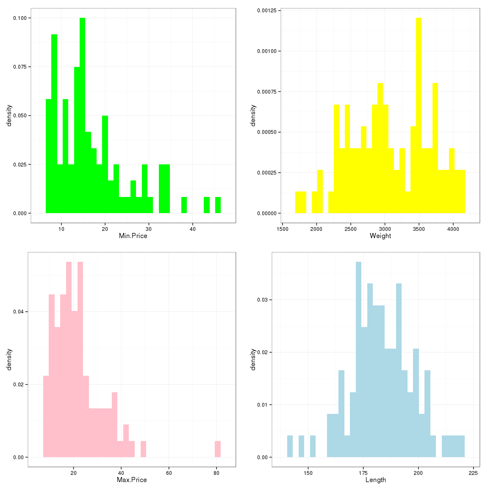
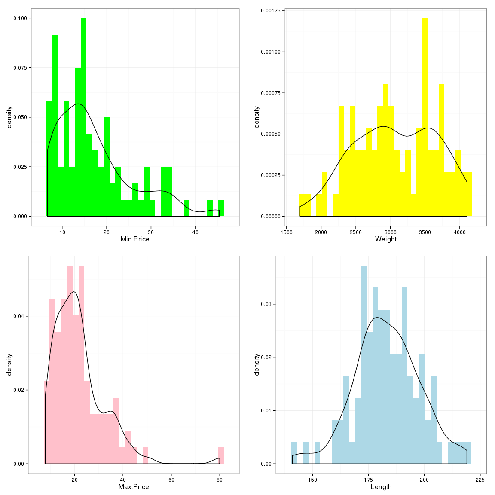
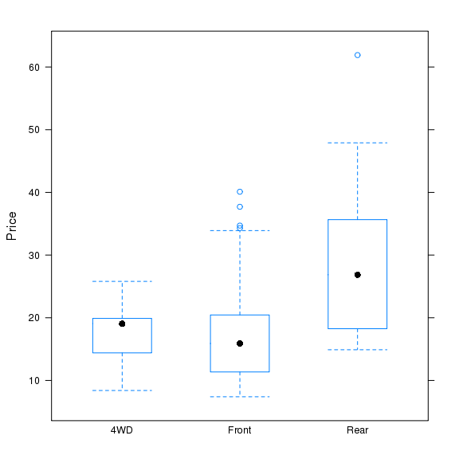
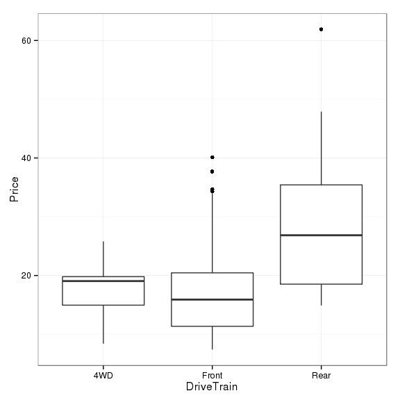
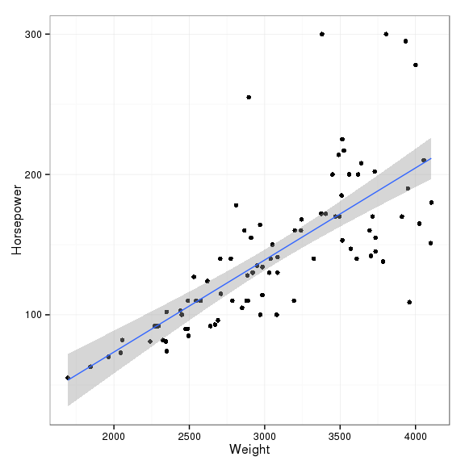

This document assumes you are using the
[Rstudio](https://www.rstudio.com/)
[IDE](https://www.rstudio.com/products/RStudio/). The best way to obtain
this document and examine all the files associated with the project is
to:

1.  [Fork](https://help.github.com/articles/fork-a-repo/) this
    repository to your own [GitHub](https://github.com/) account.
2.  Clone the forked repository into a local RStudio
    [project](https://support.rstudio.com/hc/en-us/articles/200526207-Using-Projects).

To clone the repository, you will need a recent version of
[Git](http://git-scm.com/) installed on your machine. This [video]()
shows how to clone the repository using the RStudio
[IDE](https://www.rstudio.com/products/RStudio/). Several features from
[Pandoc](http://pandoc.org/) (MacFarlane 2015), **rmarkdown** (Allaire
et al. 2015), and **knitr** (Xie 2015) are illustrated in the document
including numerous **knitr** chunk options (both local and global) which
are fully documented [online](http://yihui.name/knitr/options/).
[Rstudio](https://www.rstudio.com/) has a great "[cheat
sheet](https://www.rstudio.com/wp-content/uploads/2015/02/rmarkdown-cheatsheet.pdf)"
for writing R markdown documents. Further information about R markdown
can be found [online](http://rmarkdown.rstudio.com/). This document
shows `R` code in the answers only when specifically directed in the
question; however, all `R` code used in the document is visible in an
**R-Code Appendix**. The [YAML](http://yaml.org/) for this document is
written as:

    ---
    title: "Homework with **rmarkdown** and **knitr**"
    author: "Alan T. Arnholt"
    date: '2015-07-21'
    output: html_document
    bibliography:
    - References/PackagesUsed.bib
    - References/Main.bib
    ---

To add a bibliography to your document, you will need to create one or
more `*.bib` files and add the YAML entry
`bibliography: PathTo/file.bib` or use a list as above for multiple
`*.bib` files. The **knitr** function `write_bib()` (Xie 2015) is used
to create *automagically* a `*.bib` file of the `R` packages used in
this document and store the file in `./References/PackagesUsed.bib` (See
the **R-Code Appendix**). The two entries in `./References/Main.bib`
were created by hand. The citation management system
[Zotero](https://www.zotero.org/) can create `BibTeX` files. This [4
minute
video](https://www.youtube.com/watch?v=erTi298SX_w&list=PLJBNI3mCp9g0wsSDK111qgimqVF1dwPXO)
illustrates how to store bibliographic information using Zotero, and the
following [2 minute
video](https://www.youtube.com/watch?v=ixUF3BN_KOA&list=PLJBNI3mCp9g0wsSDK111qgimqVF1dwPXO&index=3)
shows how to export the bibliographic information from Zotero to a
`BibTeX` file. Inline `LaTeX` equations and display equations are placed
between single and double `$` symbols, respectively. To learn more about
`LaTeX`, see online resources such as
[<https://en.wikibooks.org/wiki/LaTeX>](https://en.wikibooks.org/wiki/LaTeX).
If you need help with how to write a symbol in `LaTeX`, you can draw the
symbol at this [site](http://detexify.kirelabs.org/classify.html); and
`LaTeX` code corresponding to the user drawn symbol will appear.

Notes:
------

1.  The [RStudio](https://www.rstudio.com/)
    [IDE](https://www.rstudio.com/products/RStudio/) will populate most
    entries for the YAML; however, you will need manually to add the
    `bibliography` entry.
2.  To create a PDF document (you must have
    [LaTeX](http://latex-project.org/ftp.html) installed) or a Word
    document, change the YAML entry `output: html_document` to
    `output: pdf_document` or `output: word_document`, respectively.
3.  To define the styles in a Word document generated from R markdown
    see this [video](https://vimeo.com/110804387).

Code chunks
-----------

    knitr::opts_chunk$set(fig.show = 'as.is', fig.height = 6,  
                          fig.width = 6, prompt = FALSE, highlight = TRUE, 
                          tidy = FALSE, warning = FALSE, message = FALSE, 
                          echo = FALSE, tidy.opts=list(blank = TRUE, width.cutoff= 65))
    # Lists of R packages used
    PackagesUsed <- c("PASWR2", "ggplot2", "knitr", "MASS", "DT", "lattice", "rmarkdown")
    # Write bib information
    knitr::write_bib(PackagesUsed, file = "./References/PackagesUsed.bib")
    # Load packages
    lapply(PackagesUsed, library, character.only = TRUE)

1.  The first code chunk named `setup` has local options `echo = FALSE`,
    `results= 'hide'`, `message = FALSE`, and `warning = FALSE`. These
    options have the chunk execute without echoing the code, displaying
    any results, messages, or warnings in the console. The global
    options for the document are defined with `knitr::opts_chunk$set()`
    (shown below). After the global options are defined, a character
    vector (`PackagesUsed`) is created with the names of the packages
    used in this document. The bibliographic information for the
    packages is automatically written to a file with the `write_bib()`
    function. Last, the packages are loaded and attached. If your
    installation does not have any of the packages referenced in
    `PackagesUsed`, you should install the missing packages using the
    function `install.packages()`.

2.  The second code chunk named `load` uses the local options
    `echo = TRUE`, `comment = NA`, and `prompt = TRUE`. The
    `echo = TRUE` overwrites the global option `echo = FALSE` and echoes
    all `R` code and output to the console. The option `comment = NA`
    removes the default comment (`##`), and the option `prompt = TRUE`
    displays the `R` prompt symbol (`>`).

3.  The third code chunk named `partA` changes the height and width of
    the plot used in the graphics device from the global settings of 5
    and 5, to 12 and 12 with the options `fig.height = 12`, and
    `fig.width = 12`.

4.  The fourth code chunk named `partB` changes the height and width of
    the plot used in the graphics device from the global settings of 5
    and 5, to 12 and 12 with the options `fig.height = 12`, and
    `fig.width = 12`.

5.  The fifth code chunk named `partC` does not overwrite any of the
    global option setting.

6.  The sixth code chunk named `partD` does not overwrite any of the
    global options.

7.  The seventh code chunk named `partE` hides output send to the
    console with the local option `results = "hide"`.

8.  The eighth code chunk named `tablestuff` uses the default global
    options.

9.  The ninth code chunk named `appendix` shows all of the code used for
    all code chunks without evaluating the code with the options
    `echo = TRUE`, `ref.label = all_labels()`, and `eval = FALSE`.

10. The tenth code chunk named `SessionInfo` uses the local option
    `echo = TRUE` to show the results of `sessionInfo()` in the console.

------------------------------------------------------------------------

#### Modified question 2 from chapter 2 of (Ugarte, Militino, and Arnholt 2015) with brief answers.

Load `Cars93` from the **MASS** package (Ripley 2015), and use the
function `str()` on the `Cars93` data frame.

    > library(MASS)  
    > str(Cars93)

    'data.frame':   93 obs. of  27 variables:
     $ Manufacturer      : Factor w/ 32 levels "Acura","Audi",..: 1 1 2 2 3 4 4 4 4 5 ...
     $ Model             : Factor w/ 93 levels "100","190E","240",..: 49 56 9 1 6 24 54 74 73 35 ...
     $ Type              : Factor w/ 6 levels "Compact","Large",..: 4 3 1 3 3 3 2 2 3 2 ...
     $ Min.Price         : num  12.9 29.2 25.9 30.8 23.7 14.2 19.9 22.6 26.3 33 ...
     $ Price             : num  15.9 33.9 29.1 37.7 30 15.7 20.8 23.7 26.3 34.7 ...
     $ Max.Price         : num  18.8 38.7 32.3 44.6 36.2 17.3 21.7 24.9 26.3 36.3 ...
     $ MPG.city          : int  25 18 20 19 22 22 19 16 19 16 ...
     $ MPG.highway       : int  31 25 26 26 30 31 28 25 27 25 ...
     $ AirBags           : Factor w/ 3 levels "Driver & Passenger",..: 3 1 2 1 2 2 2 2 2 2 ...
     $ DriveTrain        : Factor w/ 3 levels "4WD","Front",..: 2 2 2 2 3 2 2 3 2 2 ...
     $ Cylinders         : Factor w/ 6 levels "3","4","5","6",..: 2 4 4 4 2 2 4 4 4 5 ...
     $ EngineSize        : num  1.8 3.2 2.8 2.8 3.5 2.2 3.8 5.7 3.8 4.9 ...
     $ Horsepower        : int  140 200 172 172 208 110 170 180 170 200 ...
     $ RPM               : int  6300 5500 5500 5500 5700 5200 4800 4000 4800 4100 ...
     $ Rev.per.mile      : int  2890 2335 2280 2535 2545 2565 1570 1320 1690 1510 ...
     $ Man.trans.avail   : Factor w/ 2 levels "No","Yes": 2 2 2 2 2 1 1 1 1 1 ...
     $ Fuel.tank.capacity: num  13.2 18 16.9 21.1 21.1 16.4 18 23 18.8 18 ...
     $ Passengers        : int  5 5 5 6 4 6 6 6 5 6 ...
     $ Length            : int  177 195 180 193 186 189 200 216 198 206 ...
     $ Wheelbase         : int  102 115 102 106 109 105 111 116 108 114 ...
     $ Width             : int  68 71 67 70 69 69 74 78 73 73 ...
     $ Turn.circle       : int  37 38 37 37 39 41 42 45 41 43 ...
     $ Rear.seat.room    : num  26.5 30 28 31 27 28 30.5 30.5 26.5 35 ...
     $ Luggage.room      : int  11 15 14 17 13 16 17 21 14 18 ...
     $ Weight            : int  2705 3560 3375 3405 3640 2880 3470 4105 3495 3620 ...
     $ Origin            : Factor w/ 2 levels "USA","non-USA": 2 2 2 2 2 1 1 1 1 1 ...
     $ Make              : Factor w/ 93 levels "Acura Integra",..: 1 2 4 3 5 6 7 9 8 10 ...

1.  Create density histograms for the variables `Min.Price`,
    `Max.Price`, `Weight`, and `Length` variables using a different
    color for each histogram.

1.  Superimpose estimated density curves over the histograms.

1.  Use the `bwplot()` function from **lattice** (Sarkar 2015) to create
    a box and whiskers plot of Price for every type of vehicle according
    to the drive train. Do you observe any differences between prices?
    *Rear wheel drive vehicles are generally more expensive than either
    4WD or front wheel drive vehicles.*

1.  Create a graph similar to the one created in (c) using functions
    from **ggplot2** (Wickham and Chang 2015).

1.  Create scatter plot of `Horsepower` versus `Weight`, and superimpose
    the least squares line from regressing `Horsepower` onto `Weight`.
    Write out the least squares line and the theoretical least squares
    model.

The least squares line from regressing `Horsepower` onto `Weight` is:
*Y**h**a**t* =  -57.7382032 + 0.0655947  × Weight. The
theoretical model for least squares regression is:
*Y* = *β*0 + *β*1*x* + *ϵ* where
*ϵ* ∼ *N*(0, *σ*2).

------------------------------------------------------------------------

Use the data frame `EPIDURALF` from the **PASWR2** package (Arnholt
2014), and create a table of the average weight of parturient women
classified by `ease` and `treatment`.

<table>
<caption>Table: Mean weight (kg.) of parturient women classified by <code>ease</code> and <code>treatment</code></caption>
<thead>
<tr class="header">
<th align="left"></th>
<th align="right">Hamstring Stretch</th>
<th align="right">Traditional Sitting</th>
</tr>
</thead>
<tbody>
<tr class="odd">
<td align="left">Easy</td>
<td align="right">78.67000</td>
<td align="right">79.40187</td>
</tr>
<tr class="even">
<td align="left">Difficult</td>
<td align="right">92.66667</td>
<td align="right">94.27451</td>
</tr>
<tr class="odd">
<td align="left">Impossible</td>
<td align="right">127.87500</td>
<td align="right">113.61538</td>
</tr>
</tbody>
</table>

------------------------------------------------------------------------

R-Code Appendix
===============

    knitr::opts_chunk$set(fig.show = 'as.is', fig.height = 6, 
                          fig.width = 6, prompt = FALSE, highlight = TRUE, 
                          tidy = FALSE, warning = FALSE, message = FALSE, 
                          echo = FALSE, tidy.opts=list(blank = TRUE, width.cutoff= 65))
    # Lists of R packages used
    PackagesUsed <- c("PASWR2", "ggplot2", "knitr", "MASS", "DT", "lattice", "rmarkdown")
    # Write bib information
    knitr::write_bib(PackagesUsed, file = "./References/PackagesUsed.bib")
    # Load packages
    lapply(PackagesUsed, library, character.only = TRUE)
    library(MASS)  
    str(Cars93)
    # Create graphs for part a
    p1 <- ggplot(data = Cars93, aes(x = Min.Price, y = ..density..)) + 
      geom_histogram(fill = "green") + 
      theme_bw()
    p2 <- ggplot(data = Cars93, aes(x = Max.Price, y = ..density..)) + 
      geom_histogram(fill = "pink") + 
      theme_bw()
    p3 <- ggplot(data = Cars93, aes(x = Weight, y = ..density..)) + 
      geom_histogram(fill = "yellow") + 
      theme_bw()
    p4 <- ggplot(data = Cars93, aes(x = Length, y = ..density..)) + 
      geom_histogram(fill = "lightblue") + 
      theme_bw()
    multiplot(p1, p2, p3, p4, cols = 2)
    # Create graphs for part b
    p1 <- ggplot(data = Cars93, aes(x = Min.Price, y = ..density..)) + 
      geom_histogram(fill = "green") + 
      theme_bw() + 
      geom_density()
    p2 <- ggplot(data = Cars93, aes(x = Max.Price, y = ..density..)) + 
      geom_histogram(fill = "pink") + 
      theme_bw() + 
      geom_density()
    p3 <- ggplot(data = Cars93, aes(x = Weight, y = ..density..)) + 
      geom_histogram(fill = "yellow") + 
      theme_bw() + 
      geom_density()
    p4 <- ggplot(data = Cars93, aes(x = Length, y = ..density..)) + 
      geom_histogram(fill = "lightblue") + 
      theme_bw() + 
      geom_density()
    multiplot(p1, p2, p3, p4, cols = 2)
    # Graph for part c
    bwplot(Price ~ DriveTrain, data = Cars93)
    # Graph for part d
    ggplot(data = Cars93, aes(x = DriveTrain, y = Price)) +
      geom_boxplot() +
      theme_bw()
    # Graph for part e
    ggplot(data = Cars93, aes(x = Weight, y = Horsepower)) + 
      geom_point() + 
      stat_smooth(method = "lm") + 
      theme_bw()
    mod_lm <- lm(Horsepower ~ Weight, data = Cars93)
    summary(mod_lm)
    # Create requested table with kable
    # levels in order of difficulty
    EPIDURALF$ease <- factor(EPIDURALF$ease, levels = c("Easy", "Difficult", "Impossible")) 
    TS <- with(data = EPIDURALF, {tapply(kg, list(ease, treatment), mean)})
    DF <- data.frame(TS)
    knitr::kable(DF, col.names = c("Hamstring Stretch", "Traditional Sitting"), 
                 caption = "Table: Mean weight (kg.) of parturient women 
                 classified by `ease` and `treatment`")
    sessionInfo()

It is always a good idea to include your `sessionInfo()`:

    sessionInfo()

    ## R version 3.2.1 (2015-06-18)
    ## Platform: x86_64-unknown-linux-gnu (64-bit)
    ## Running under: Red Hat Enterprise Linux Server release 6.6 (Santiago)
    ## 
    ## locale:
    ##  [1] LC_CTYPE=en_US.UTF-8       LC_NUMERIC=C              
    ##  [3] LC_TIME=en_US.UTF-8        LC_COLLATE=en_US.UTF-8    
    ##  [5] LC_MONETARY=en_US.UTF-8    LC_MESSAGES=en_US.UTF-8   
    ##  [7] LC_PAPER=en_US.UTF-8       LC_NAME=C                 
    ##  [9] LC_ADDRESS=C               LC_TELEPHONE=C            
    ## [11] LC_MEASUREMENT=en_US.UTF-8 LC_IDENTIFICATION=C       
    ## 
    ## attached base packages:
    ## [1] stats     graphics  grDevices utils     datasets  methods   base     
    ## 
    ## other attached packages:
    ## [1] rmarkdown_0.7   DT_0.1          MASS_7.3-40     knitr_1.10.5   
    ## [5] PASWR2_1.0      lattice_0.20-31 ggplot2_1.0.1  
    ## 
    ## loaded via a namespace (and not attached):
    ##  [1] Rcpp_0.11.6      magrittr_1.5     munsell_0.4.2    colorspace_1.2-6
    ##  [5] highr_0.5        stringr_1.0.0    plyr_1.8.3       tools_3.2.1     
    ##  [9] grid_3.2.1       gtable_0.1.2     e1071_1.6-4      htmltools_0.2.6 
    ## [13] class_7.3-12     yaml_2.1.13      digest_0.6.8     reshape2_1.4.1  
    ## [17] formatR_1.2      htmlwidgets_0.5  evaluate_0.7     labeling_0.3    
    ## [21] stringi_0.5-5    scales_0.2.5     proto_0.3-10

------------------------------------------------------------------------

References
==========

Allaire, JJ, Joe Cheng, Yihui Xie, Jonathan McPherson, Winston Chang,
Jeff Allen, Hadley Wickham, and Rob Hyndman. 2015. *Rmarkdown: Dynamic
Documents for R*. <http://CRAN.R-project.org/package=rmarkdown>.

Arnholt, Alan T. 2014. *PASWR2: Probability and Statistics with R,
Second Edition*. <http://CRAN.R-project.org/package=PASWR2>.

MacFarlane, John. 2015. *Pandoc: A Universal Document Converter*.
<http://johnmacfarlane.net/pandoc/index.html>.

Ripley, Brian. 2015. *MASS: Support Functions and Datasets for Venables
and Ripley’s MASS*. <http://CRAN.R-project.org/package=MASS>.

Sarkar, Deepayan. 2015. *Lattice: Lattice Graphics*.
<http://CRAN.R-project.org/package=lattice>.

Ugarte, María Dolores, Ana F. Militino, and Alan T.
Arnholt. 2015. *Probability and Statistics with R*. Second. Boca Raton,
FL: CRC Press.

Wickham, Hadley, and Winston Chang. 2015. *Ggplot2: An Implementation of
the Grammar of Graphics*. <http://CRAN.R-project.org/package=ggplot2>.

Xie, Yihui. 2015. *Knitr: A General-Purpose Package for Dynamic Report
Generation in R*. <http://CRAN.R-project.org/package=knitr>.
